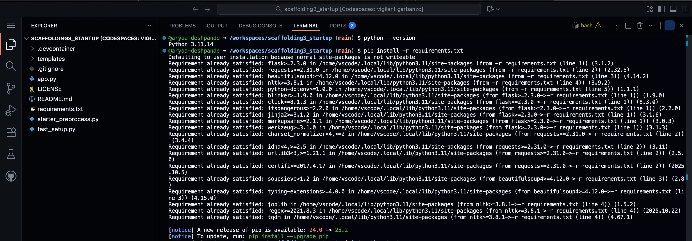
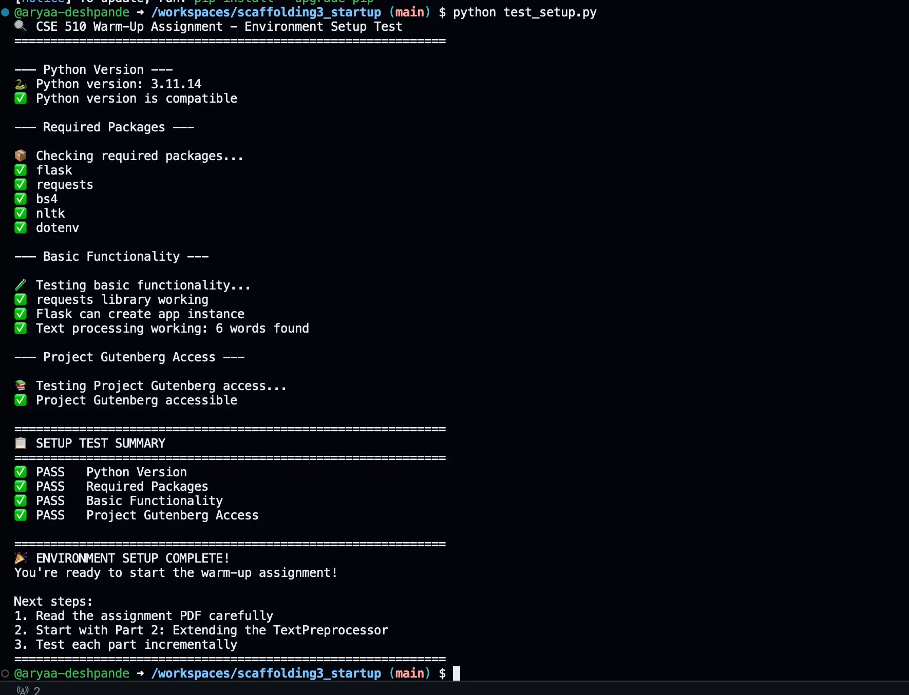
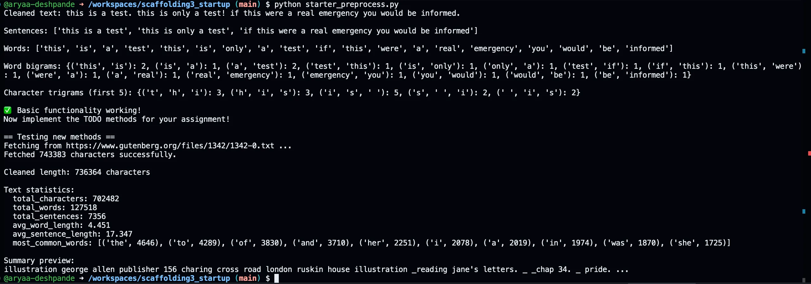
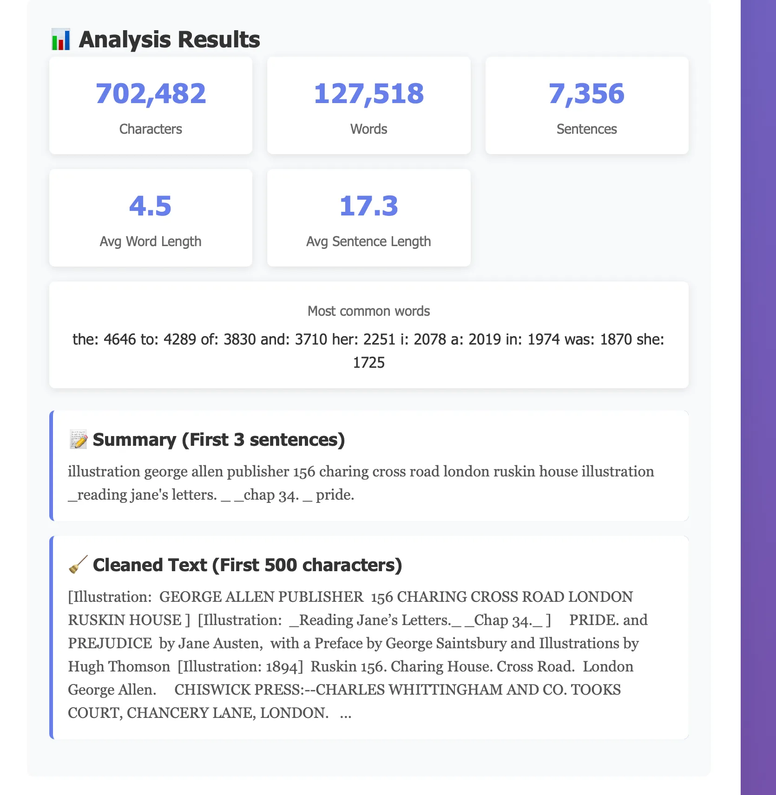
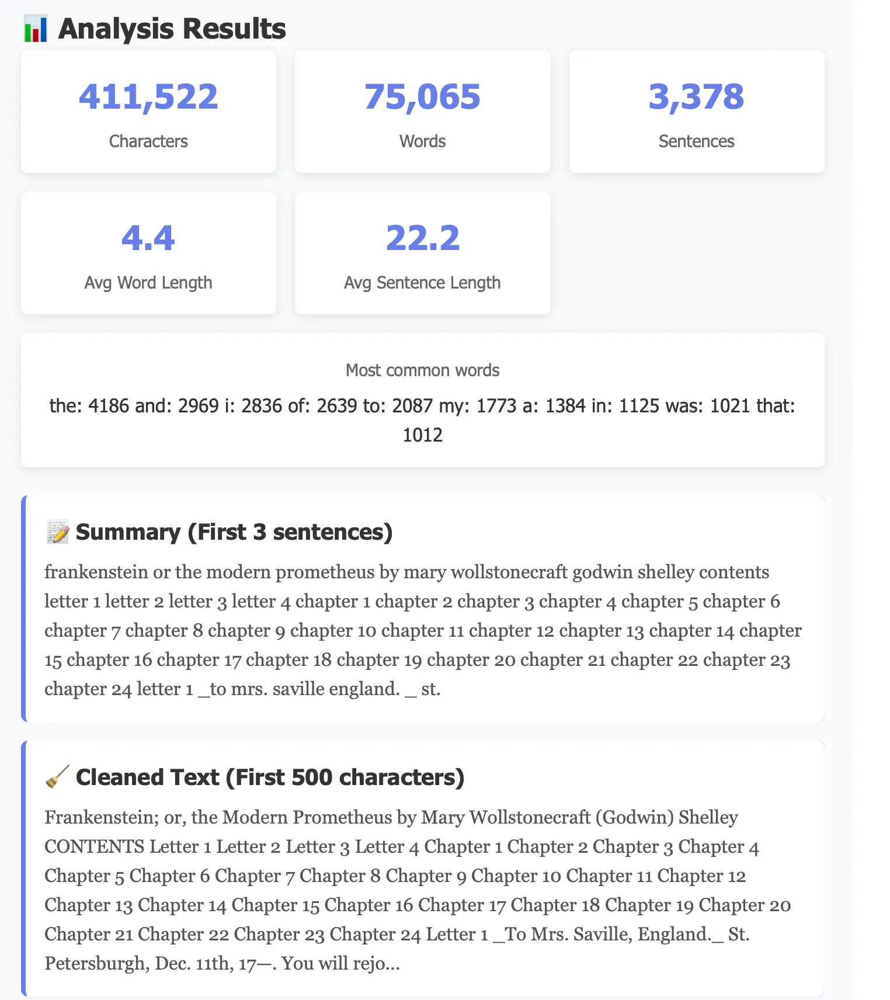
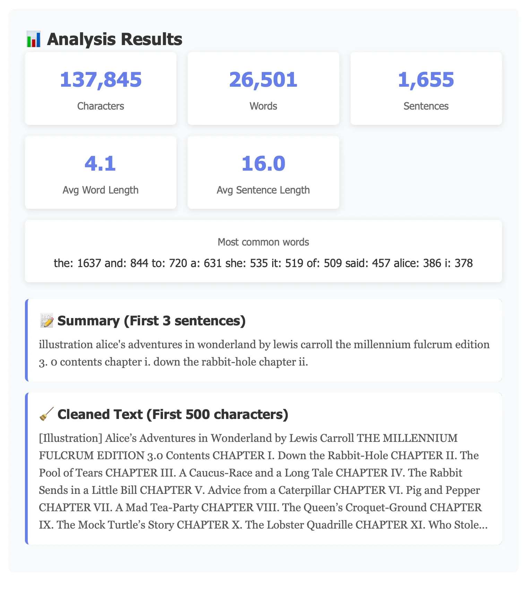
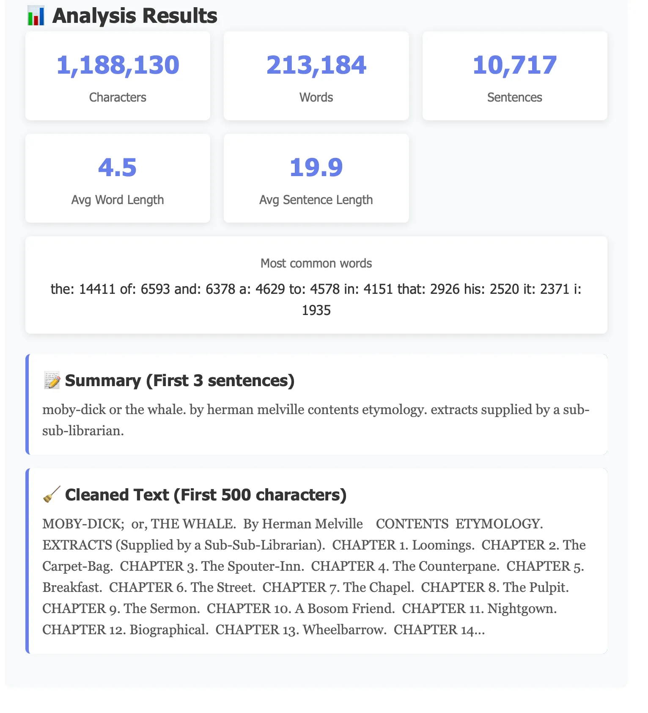
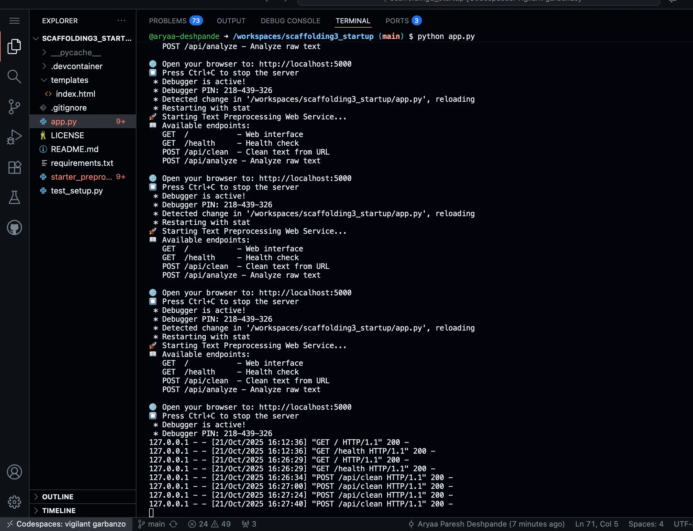

# Scaffolding Assignment 3 — Gutenberg Text Preprocessing Service  
**Course:** EAS 510 – Basics of AI  
**Author:** Aryaa Paresh Deshpande  
**Semester:** Fall 2025  

---

## Overview
This project implements a **Flask-based web service** that downloads plain-text books from Project Gutenberg, cleans and normalizes them, computes descriptive statistics, and generates a short extractive summary.

It forms the warm-up for later language-modeling work (Shannon assignment) and demonstrates end-to-end text preprocessing.

---

# Setup & Execution


## Open the provided Codespace


## Install dependencies
```
pip install -r requirements.txt
```

## Verify environment (setup test)
```
python test_setup.py
```

## Run the Flask server
```
python app.py
# Visit http://localhost:5000
```


---

# File Structure

starter_preprocess.py   ->  TextPreprocessor class (Part 2)
app.py                  ->  Flask API service (Part 3)
templates/index.html    ->  Front-end interface (Part 4)
screenshots/            ->  Working application screenshots
requirements.txt
README.md


---

# API Endpoints
```
GET /health

Returns a quick service status.
Example Response

{ "status": "healthy", "message": "Text preprocessing service is running" }
```

---

POST /api/clean
```
Fetches and analyzes text from a Project Gutenberg URL.

Input

{ "url": "https://www.gutenberg.org/files/11/11-0.txt" }

Response

{
  "success": true,
  "cleaned_text": "first ~2000 characters…",
  "statistics": {
    "total_characters": 702482,
    "total_words": 127518,
    "total_sentences": 7356,
    "avg_word_length": 4.45,
    "avg_sentence_length": 17.35,
    "most_common_words": [["the",4646],["to",4289],["of",3830],…]
  },
  "summary": "First three sentences of the book",
  "error": null
}
```

---

POST /api/analyze
```
Analyzes raw text without fetching a URL.

Input

{ "text": "Alice was beginning to get very tired of sitting by her sister on the bank." }

Response

{
  "success": true,
  "statistics": { … },
  "summary": "Alice was beginning to get very tired …",
  "error": null
}
```

---

# Testing & Verification

	1.	Run python app.py
	2.	Open http://localhost:5000
	3.	Paste one of the example URLs and click Clean & Analyze Text
	4.	Results panel displays statistics, summary, and cleaned preview.


---

# Example Gutenberg URLs

1. Pride and Prejudice – Jane Austen	https://www.gutenberg.org/files/1342/1342-0.txt
2. Frankenstein – Mary Shelley	https://www.gutenberg.org/files/84/84-0.txt
3. Alice in Wonderland – Lewis Carroll	https://www.gutenberg.org/files/11/11-0.txt
4. Moby Dick – Herman Melville	https://www.gutenberg.org/files/2701/2701-0.txt


---

# Features Implemented
	•	fetch_from_url() → Downloads and validates text files
	•	clean_gutenberg_text() → Removes headers & footers
	•	normalize_text() → Lowercases and standardizes punctuation
	•	get_text_statistics() → Computes characters, words, sentences, averages, top 10 words
	•	create_summary() → Returns first 3 sentences of the cleaned text
	•	Flask Endpoints → /api/clean, /api/analyze, /health
	•	Frontend → Interactive form with loading state and result display


---

# Repository Link:
```         
https://github.com/aryaa-deshpande/scaffolding3_startup.git
```
---

# Screenshots:















